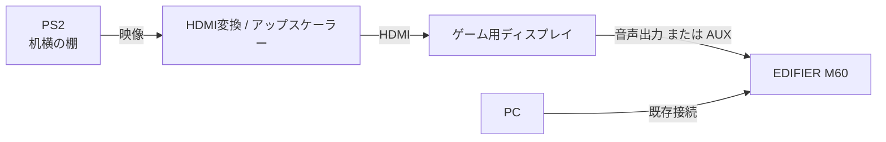

# 配線コンセプト

## 基本方針

ゲーム機は机横の棚に置き、ゲーム用ディスプレイへ映像を送る。
音声は既存のEDIFIER M60を流用する。

## 想定構成

## 未確定事項

- PS2からHDMIへ変換する機器
- ディスプレイの音声出力方式
- EDIFIER M60の現在のPC接続方式
- ゲーム時の入力切替方法

## 配線設計の注意点

- 昇降時にHDMI・電源・音声ケーブルが張らないこと
- 可動部でケーブルが折れ続けないこと
- 足元にケーブルが垂れないこと
- PS2のディスク交換を妨げないこと
